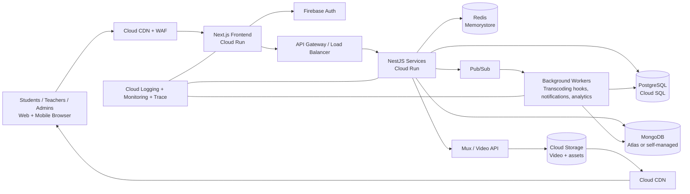

# DP Education LMS Clone — System Architecture & Core Database Schema

## 1) System Architecture (GCP + Next.js + NestJS)

### 1.1 High-Level Component View



### 1.2 Request and Data Flow

1. **Authentication**
   - User logs in via Firebase Auth (email/password, social, phone, SSO).
   - Frontend receives Firebase ID token and attaches it to API requests.
   - Backend verifies token using Firebase Admin SDK and maps to internal RBAC roles.

2. **Content delivery and SEO**
   - Next.js runs in SSR/ISR mode on Cloud Run for SEO-sensitive pages (course landing pages).
   - Static assets are stored in Cloud Storage and delivered through Cloud CDN.

3. **Learning APIs**
   - NestJS services expose versioned REST endpoints (`/api/v1/...`).
   - PostgreSQL stores transactional entities (users, enrollments, quizzes, attempts, progress snapshots).
   - MongoDB stores flexible course metadata (localized rich content blocks, dynamic lesson configs).
   - Redis handles caching (dashboard summaries, course catalog fragments, signed URL session tokens).

4. **Video streaming**
   - Video master files are uploaded to Cloud Storage, then ingested by Mux/Video API.
   - Playback uses adaptive bitrate HLS/DASH URLs via CDN for low-latency and rural-network resiliency.
   - Short-lived signed playback tokens protect premium content.

5. **Async pipelines**
   - Events (lesson completed, quiz submitted, video progress heartbeat) are published to Pub/Sub.
   - Workers aggregate analytics, compute progression milestones, and update denormalized tables/caches.

### 1.3 Service Boundaries (MVP)

- **Identity Service**: Firebase integration + profile sync + role mapping.
- **Course Service**: courses, modules, lessons, localization references.
- **Assessment Service**: quizzes, attempts, scoring, exam window enforcement.
- **Progress Service**: lesson/video/quiz progress and dashboard aggregates.
- **Media Service**: signed playback URLs, DRM/token enforcement, watch telemetry.

### 1.4 Non-Functional Architecture Decisions

- **Target scale**: 100k+ concurrent learners.
- **Stateless compute**: all API instances on Cloud Run with autoscaling.
- **Multilingual-first**: UTF-8 everywhere, locale-specific text in translation tables + Mongo metadata.
- **Observability**: trace IDs propagated from frontend to backend and workers.
- **Security**: JWT verification, row-level access checks, signed URLs, WAF + rate limiting.

---

## 2) Core Database Schema

> Hybrid model: **PostgreSQL** for relational integrity and reporting, **MongoDB** for flexible localized course structures.

## 2.1 PostgreSQL (Transactional Core)

### `users`
| Column | Type | Constraints | Notes |
|---|---|---|---|
| id | UUID | PK | Internal user ID |
| firebase_uid | VARCHAR(128) | UNIQUE, NOT NULL | Auth provider identity |
| email | CITEXT | UNIQUE | Nullable for phone-only auth |
| phone_e164 | VARCHAR(20) | UNIQUE | Nullable |
| full_name | VARCHAR(255) | NOT NULL | Unicode supported |
| preferred_language | VARCHAR(5) | NOT NULL DEFAULT 'en' | `en`, `si`, `ta` |
| role | VARCHAR(20) | NOT NULL | `student`, `teacher`, `admin` |
| status | VARCHAR(20) | NOT NULL DEFAULT 'active' | `active`, `suspended`, `deleted` |
| created_at | TIMESTAMPTZ | NOT NULL DEFAULT now() |  |
| updated_at | TIMESTAMPTZ | NOT NULL DEFAULT now() |  |

Indexes:
- `idx_users_firebase_uid`
- `idx_users_role_status`

### `courses`
| Column | Type | Constraints | Notes |
|---|---|---|---|
| id | UUID | PK |  |
| slug | VARCHAR(160) | UNIQUE, NOT NULL | SEO URL key |
| grade_level | SMALLINT | NOT NULL | e.g., 6..13 |
| subject | VARCHAR(80) | NOT NULL | Math, Science... |
| default_language | VARCHAR(5) | NOT NULL DEFAULT 'si' |  |
| published_status | VARCHAR(20) | NOT NULL | `draft`, `published`, `archived` |
| thumbnail_url | TEXT | NULL | CDN URL |
| created_by | UUID | FK -> users(id), NOT NULL | Teacher/Admin |
| created_at | TIMESTAMPTZ | NOT NULL DEFAULT now() |  |
| updated_at | TIMESTAMPTZ | NOT NULL DEFAULT now() |  |

Indexes:
- `idx_courses_subject_grade`
- `idx_courses_status`

### `course_translations`
| Column | Type | Constraints | Notes |
|---|---|---|---|
| id | UUID | PK |  |
| course_id | UUID | FK -> courses(id), NOT NULL |  |
| language_code | VARCHAR(5) | NOT NULL | `en`, `si`, `ta` |
| title | VARCHAR(255) | NOT NULL | Unicode |
| short_description | TEXT | NULL |  |
| long_description | TEXT | NULL |  |
| seo_meta | JSONB | NULL | Title/description/keywords |
| created_at | TIMESTAMPTZ | NOT NULL DEFAULT now() |  |
| updated_at | TIMESTAMPTZ | NOT NULL DEFAULT now() |  |

Constraints:
- `UNIQUE(course_id, language_code)`

### `lessons`
| Column | Type | Constraints | Notes |
|---|---|---|---|
| id | UUID | PK |  |
| course_id | UUID | FK -> courses(id), NOT NULL |  |
| sequence_no | INT | NOT NULL | Ordering within course |
| lesson_type | VARCHAR(30) | NOT NULL | `video`, `article`, `live`, `quiz` |
| duration_seconds | INT | NULL | Estimated duration |
| video_asset_id | VARCHAR(128) | NULL | Mux/Video provider ID |
| is_preview | BOOLEAN | NOT NULL DEFAULT false | Public sample |
| publish_at | TIMESTAMPTZ | NULL | Scheduled release |
| created_at | TIMESTAMPTZ | NOT NULL DEFAULT now() |  |
| updated_at | TIMESTAMPTZ | NOT NULL DEFAULT now() |  |

Constraints:
- `UNIQUE(course_id, sequence_no)`

### `lesson_translations`
| Column | Type | Constraints | Notes |
|---|---|---|---|
| id | UUID | PK |  |
| lesson_id | UUID | FK -> lessons(id), NOT NULL |  |
| language_code | VARCHAR(5) | NOT NULL |  |
| title | VARCHAR(255) | NOT NULL |  |
| summary | TEXT | NULL |  |
| body_markdown | TEXT | NULL | For article lessons |
| created_at | TIMESTAMPTZ | NOT NULL DEFAULT now() |  |
| updated_at | TIMESTAMPTZ | NOT NULL DEFAULT now() |  |

Constraints:
- `UNIQUE(lesson_id, language_code)`

### `enrollments`
| Column | Type | Constraints | Notes |
|---|---|---|---|
| id | UUID | PK |  |
| user_id | UUID | FK -> users(id), NOT NULL |  |
| course_id | UUID | FK -> courses(id), NOT NULL |  |
| enrollment_status | VARCHAR(20) | NOT NULL DEFAULT 'active' | `active`, `completed`, `dropped` |
| enrolled_at | TIMESTAMPTZ | NOT NULL DEFAULT now() |  |
| completed_at | TIMESTAMPTZ | NULL |  |

Constraints:
- `UNIQUE(user_id, course_id)`

### `quizzes`
| Column | Type | Constraints | Notes |
|---|---|---|---|
| id | UUID | PK |  |
| lesson_id | UUID | FK -> lessons(id), NOT NULL | Typically one quiz lesson |
| title | VARCHAR(255) | NOT NULL |  |
| time_limit_seconds | INT | NULL | Timed assessments |
| total_marks | NUMERIC(8,2) | NOT NULL DEFAULT 0 |  |
| pass_marks | NUMERIC(8,2) | NULL |  |
| randomize_questions | BOOLEAN | NOT NULL DEFAULT false |  |
| is_exam | BOOLEAN | NOT NULL DEFAULT false |  |
| starts_at | TIMESTAMPTZ | NULL | Exam window start |
| ends_at | TIMESTAMPTZ | NULL | Exam window end |
| created_at | TIMESTAMPTZ | NOT NULL DEFAULT now() |  |
| updated_at | TIMESTAMPTZ | NOT NULL DEFAULT now() |  |

### `quiz_questions`
| Column | Type | Constraints | Notes |
|---|---|---|---|
| id | UUID | PK |  |
| quiz_id | UUID | FK -> quizzes(id), NOT NULL |  |
| question_type | VARCHAR(30) | NOT NULL | `mcq_single`, `mcq_multi`, `short_text` |
| prompt | TEXT | NOT NULL |  |
| options_json | JSONB | NULL | Option set |
| correct_answer_json | JSONB | NULL | Securely handled |
| marks | NUMERIC(6,2) | NOT NULL DEFAULT 1 |  |
| sequence_no | INT | NOT NULL |  |

Constraints:
- `UNIQUE(quiz_id, sequence_no)`

### `quiz_attempts`
| Column | Type | Constraints | Notes |
|---|---|---|---|
| id | UUID | PK |  |
| quiz_id | UUID | FK -> quizzes(id), NOT NULL |  |
| user_id | UUID | FK -> users(id), NOT NULL |  |
| attempt_no | INT | NOT NULL | 1..N |
| started_at | TIMESTAMPTZ | NOT NULL DEFAULT now() |  |
| submitted_at | TIMESTAMPTZ | NULL |  |
| score | NUMERIC(8,2) | NULL |  |
| status | VARCHAR(20) | NOT NULL DEFAULT 'in_progress' | `in_progress`, `submitted`, `evaluated` |
| answers_json | JSONB | NULL | Raw attempt payload |

Constraints:
- `UNIQUE(quiz_id, user_id, attempt_no)`

### `lesson_progress`
| Column | Type | Constraints | Notes |
|---|---|---|---|
| id | UUID | PK |  |
| user_id | UUID | FK -> users(id), NOT NULL |  |
| course_id | UUID | FK -> courses(id), NOT NULL |  |
| lesson_id | UUID | FK -> lessons(id), NOT NULL |  |
| progress_percent | NUMERIC(5,2) | NOT NULL DEFAULT 0 | 0..100 |
| completed | BOOLEAN | NOT NULL DEFAULT false |  |
| first_accessed_at | TIMESTAMPTZ | NULL |  |
| last_accessed_at | TIMESTAMPTZ | NULL |  |
| completed_at | TIMESTAMPTZ | NULL |  |

Constraints:
- `UNIQUE(user_id, lesson_id)`

Indexes:
- `idx_lesson_progress_user_course`
- `idx_lesson_progress_completed`

### `video_watch_events` (high-write, partitioned)
| Column | Type | Constraints | Notes |
|---|---|---|---|
| id | BIGSERIAL | PK |  |
| user_id | UUID | FK -> users(id), NOT NULL |  |
| lesson_id | UUID | FK -> lessons(id), NOT NULL |  |
| watched_seconds | INT | NOT NULL | Heartbeat delta |
| playback_position | INT | NOT NULL | Latest player time |
| event_at | TIMESTAMPTZ | NOT NULL DEFAULT now() | Partition key candidate |
| device_type | VARCHAR(30) | NULL | mobile/tablet/desktop |
| network_quality | VARCHAR(30) | NULL | optional telemetry |

Partitioning:
- Monthly partition by `event_at` for cost-effective retention and analytics.

## 2.2 MongoDB (Flexible Course Metadata)

### `course_content_documents`
```json
{
  "_id": "ObjectId",
  "courseId": "uuid",
  "lessonId": "uuid",
  "version": 3,
  "contentBlocks": [
    { "type": "heading", "text": { "en": "Forces", "si": "බල", "ta": "வலு" } },
    { "type": "richText", "body": { "en": "...", "si": "...", "ta": "..." } },
    { "type": "interactive", "widget": "drag-drop", "config": { "difficulty": "medium" } }
  ],
  "attachments": [
    { "kind": "pdf", "url": "https://cdn..." }
  ],
  "updatedAt": "ISODate"
}
```

Rationale:
- Allows rapidly evolving lesson structures without expensive relational migrations.
- Keeps multilingual content close to render blocks for quick API composition.

## 2.3 Key Relationships Summary

- A **user** enrolls in many **courses** through `enrollments`.
- A **course** has many **lessons** and many localized records in `course_translations`.
- A **lesson** may map to one **quiz** and has localized content in `lesson_translations` + Mongo documents.
- **quiz_attempts** and **lesson_progress** together power student dashboard completion and readiness metrics.

## 2.4 Suggested First Migrations (Order)

1. `users`
2. `courses`, `course_translations`
3. `lessons`, `lesson_translations`
4. `enrollments`
5. `quizzes`, `quiz_questions`, `quiz_attempts`
6. `lesson_progress`
7. `video_watch_events` (partitioned)
